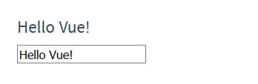

# Vue.js是什么

> Vue (读音 /vjuː/，类似于 view) 是一套用于构建用户界面的渐进式`(1)`框架。与其它大型框架不同的是，Vue 被设计为可以自底向上逐层应用。

 - `(1)` 渐进式指的就是可以一点一点(软着陆)的使用,也可以理解为一点一点的学习.

> 官方指南假设你已了解关于 HTML、CSS 和 JavaScript 的中级知识。如果你刚开始学习前端开发，将框架作为你的第一步可能不是最好的主意——掌握好基础知识再来吧！之前有其它框架的使用经验会有帮助，但这不是必需的。

# 安装

Vue在实际开发和部署都有极其复杂的环境配置.

但是对于学习来说我们只需要使用一个简单的`<script>`标签就可以了.

例如:
```html
<script src="vue.js" ></script>
```

Vue的下载可以前往:
> https://cn.vuejs.org/v2/guide/installation.html

# 起步

## 使用vue的时候我们具体在编写什么?

基本来说你需要编写两个部分:
 - 具有Vue语法的html部分 - 我们称之为HTML模板
 - 使用Vue框架的js部分 - 我们称之为Vue实例

## 引入后Vue做了什么

vue一旦插入网页中后就自动向全局注册了vue变量或者叫window下的属性比较好一些,自然类似于大部分工具例如jquery,实质上他是一个在全局挂载的函数而已.

# 声明式渲染(1)

> Vue.js 的核心是一个允许采用简洁的模板语法`(1)`来声明式地将数据渲染进 DOM 的系统：

 - `(1)` 所谓的声明式渲染指的就是以显式的声明来告诉Vue具体数据是如何输出的过程

HTML:
```html
<div id="app">
  {{ message }}
</div>
```
JavaScript:
```javascript
var app = new Vue({ // 新建一个Vue实例
  el: '#app', // 告诉Vue的作用范围在 id为root这个元素内,root元素之外的依然是普通的html
  data: {
    message: 'Hello Vue!' // data 对象中存放的数据可以在HTML模板中输出
  }
})
```
输出:
```
Hello Vue!
```

> 我们已经成功创建了第一个 Vue 应用！看起来这跟渲染一个字符串模板非常类似，但是 Vue 在背后做了大量工作。现在数据和 DOM 已经被建立了关联，所有东西都是响应式`(1)`的。

 - `(1)` 响应式指的是当Vue实例内部数据改变后,html模板部分也会随着改变.

我们要怎么确认呢？打开你的浏览器的 JavaScript 控制台 (就在这个页面打开)，并修改 app.message 的值，你将看到上例相应地更新。

__图片:chrome控制台.__  


在控制台中回车后输出为:
```
Hello world!
```

我们并没有修改HTML中的字符串,只是修改Vue实例而已,可以看到Vue做到了数据和HTML模板声明处的内容进行了数据绑定,从而允许修改数据就可以即时渲染HTML模板.

## Vue中的data属性

Vue中`data`上挂载的所有的属性都会被添加到Vue实例上.

也就是说如下的代码判断是正确的:
```javascript
var app = new Vue({
  el: 'app',
  data: {
    message: 'Hello Vue.js!'
  }
})

console.log(app.message === 'Hello Vue.js!');// true
console.log(app.message === app._data.message);// true
```
所以我们可以在控制台中直接修改`app.message`,因为他就是`app.data.message`.

**注意**:在Vue初始化后传入的`data`属性会被挂载到Vue实例的`_data`属性上,而`data`中所有的内容都会原封不动的挂载到Vue实例上.

__除了使用`{{ any }}`的方式用于输出文本,我们还可以修改其他的部分,下面的例子我们动态的修改了元素的`title`属性.__

HTML:
```html
<div id="app-2">
  <span v-bind:title="message">
    鼠标悬停几秒钟查看此处动态绑定的提示信息！
  </span>
</div>
```
JavaScript:
```javascript
var app2 = new Vue({
  el: '#app-2',
  data: {
    message: '页面加载于 ' + new Date().toLocaleString() // {1}
  }
})
```

 - `{1}` 表达式 `new Date().toLocaleString()`会返回当前地区的时间,类型为`string`.

**介绍**:这个例子中我们使用了`v-bind:`指令,该指令告诉Vue将数据和HTML元素的属性进行绑定.

当我们将鼠标移动到该元素上后会显示当前的时间.

__图片:悬浮后的效果:__  


__官方这节的解释:__  
> 这里我们遇到了一点新东西。你看到的 v-bind 特性被称为指令。指令带有前缀 v-，以表示它们是 Vue 提供的特殊特性。可能你已经猜到了，它们会在渲染的 DOM 上应用特殊的响应式行为。在这里，该指令的意思是：“将这个元素节点的 title 特性和 Vue 实例的 message 属性保持一致”。

# 条件与循环

> 控制切换一个元素是否显示也相当简单：

HTML:
```html
<div id="app-3">
  <p v-if="seen">现在你看到我了</p>
</div>
```
JavaScipt:
```javascript
var app3 = new Vue({
  el: '#app-3',
  data: {
    seen: true
  }
})
```

在此处我们使用了`v-if`指令,该指令在条件为真的时候渲染具体的元素,在本例中他依附在了`p`元素上,也就是说他的判断会控制`p`元素是否出现在html中.

> 继续在控制台输入 `app3.seen = false`，你会发现之前显示的消息消失了。

__图片:控制台输入后回车.__  


这个时候你会发现`p`元素会自动的从html中消失.

> 还有其它很多指令，每个都有特殊的功能。例如，`v-for` 指令可以绑定数组的数据来渲染一个项目列表`(1)`：

 - `(1)` 实际上就是数组

HTML:
```html
<div id="app-4">
  <ol>
    <li v-for="todo in todos">
      {{ todo.text }}
    </li>
  </ol>
</div>
```
JavaScript:
```javascript
var app4 = new Vue({
  el: '#app-4',
  data: {
    todos: [
      { text: '学习 JavaScript' },
      { text: '学习 Vue' },
      { text: '整个牛项目' }
    ]
  }
})
```
__图片:输出.__  


**分析**:`v-for`指令会遍历指定列表中的所有内容,在本例中就是`todos`,在列表中有多少个元素就会执行多少次循环,每次循环中的内容会被临时存放到一个变量中本例中是`todo`,而`todo`中存放的是一个对象其`text`键上保存了我们需要的字符串,所以我们使用`todo.text`来获取具体的内容.

> 在控制台里，输入 `app4.todos.push({ text: '新项目' })` `{1}`，你会发现列表最后添加了一个新项目。

 - `{1}` `array.push()`语法会将数组的末尾添加一个新的元素.

__图片:控制台数组添加内容.__  


# 处理用户输入

在这个例子中我们使用`v-on`指令和之前的例子不同,这次我们绑定的不是一个属性,而是一个方法.

> 为了让用户和你的应用进行交互，我们可以用 v-on 指令添加一个事件监听器，通过它调用在 Vue 实例中定义的方法.

HTML:
```html
<div id="app-5">
  <p>{{ message }}</p>
  <button v-on:click="reverseMessage">逆转消息</button> // v-on后面跟随的是标准的DOM事件名称,点击事件的标准名称为click
</div>
```
JavaScript:
```javascript
var app5 = new Vue({
  el: '#app-5',
  data: {
    message: 'Hello Vue.js!'
  },
  methods: {
    reverseMessage: function () {
      this.message = this.message.split('').reverse().join('') // {1}
    }
  }
})
```
 - `{1}` `message.split('').reverse().join('')`执行步骤为: 将字符串转为字符串序列(数组) -> 将数组每一项反转 -> 将数组合并为字符串.


__图片:没有点击按钮时候的样子:__  


__图片:点击按钮后的样子:__  


**解析**:在HTML模板中的`v-on:click="reverseMessage"`意思就是点击的时候触发Vue实例提供的`reverseMessage`事件.

这里涉及到了Vue实例上的一个新的属性`methods`该对象上挂载的所有内容都必须是**方法**,在Vue上用户提供的所有方法都会在`methods`属性上集中起来.

# Vue中的this

Vue的this指的就是Vue实例本身,上面的例子方法还可以做如下的判断:
```javascript
reverseMessage: function () {
    console.log(this === app5); // true
    console.log(this.message === app5.message); // true
    console.log(this.message === app5._data.message); //true

    this.message = this.message.split('').reverse().join('')
}
```

> Vue 还提供了 v-model 指令，它能轻松实现表单输入和应用状态之间的双向绑定`(1)`。

 - `(1)` 之前的例子中我们做的绑定都是单向绑定,也就是说Vue实例的数据变化会在HTML模板中展现出来,而双向绑定在原有的单向数据绑定上多了:如果HTML模板发生变化则Vue实例内部的数据也会随之改变.

HTML:
```html
<div id="app-6">
  <p>{{ message }}</p>
  <input v-model="message">
</div>
```
JavaScript:
```javascript
var app6 = new Vue({
  el: '#app-6',
  data: {
    message: 'Hello Vue!'
  }
})
```
__图片:未输入内容的效果.__  


__图片:输入内容的效果.__  


# 组件化应用构建

> 组件系统是 Vue 的另一个重要概念，因为它是一种抽象，允许我们使用小型、独立和通常可复用的组件构建大型应用。仔细想想，几乎任意类型的应用界面都可以抽象为一个组件树：

__图片:组件的基础概念:__  


**分析**:你可以理解为网页中有很多重复的部分例如:

 - 导航栏
 - 侧边栏
 - 一个按钮

他们都可以被视为重复的东西,也就是说他们都可以被统一封装为组件.

我知道你想说什么,是的不同页面甚至在同一个页面中这些东西看起来都是不同的.但是编程就是一门抽象的艺术,不同的外观只是CSS样式不同而已,但是他们的使用逻辑都是固定的.

例如:一个导航栏绝对不可能播放视频,而一个按钮绝对不可能当作导航栏来使用.

我们在编程中如果出项重复的部分我们会如何对待他?当然最简单的操作就是我们会**定义一个函数**将这些重复的部分打包.

Vue的**组件**(实际上其他框架中也是)就是指的这种概念,我们将网页中每个部分都拆开,利用Vue将他们封装为一个个单独的组件.

使用这些组件就像调用一个函数一样,我们可以`if`后调用也可以`for`循环中调用.

当然这还让人摸不着头脑,例如我们有一个导航栏,但是按钮如果和导航栏是两个不同的东西,那么导航栏如何知道这个按钮被点击的呢?

不用担心这些答案都会在后面的章节中逐一揭开.

## 简单的项目

这里例子中举了一个简单例子来使用Vue的组件.但是不用担心组件在这章中不是重点内容.

> 在 Vue 里，一个组件本质上是一个拥有预定义选项的一个 Vue 实例。在 Vue 中注册组件很简单：
```javascript
// 定义名为 todo-item 的新组件
Vue.component('todo-item', {
  template: '<li>这是个待办项</li>' // 组件的特性 template 属性
})
```
> 现在你可以用它构建另一个组件模板：
```html
<ol>
  <!-- 创建一个 todo-item 组件的实例 -->
  <todo-item></todo-item>
</ol>
```
> 但是这样会为每个待办项渲染同样的文本，这看起来并不炫酷。我们应该能从父作用域将数据传到子组件才对。让我们来修改一下组件的定义，使之能够接受一个 prop`(1)`：

 - `(1)` 简单的理解 prop中的内容类似于定义函数中的参数

```javascript
Vue.component('todo-item', {
  // todo-item 组件现在接受一个
  // "prop"，类似于一个自定义特性。
  // 这个 prop 名为 todo。
  props: ['todo'],
  template: '<li>{{ todo.text }}</li>'
})
```
> 现在，我们可以使用 v-bind 指令将待办项传到循环输出的每个组件中：
完整的HTML部分:
```html
<div id="app-7">
  <ol>
    <!--
      现在我们为每个 todo-item 提供 todo 对象
      todo 对象是变量，即其内容可以是动态的。
      我们也需要为每个组件提供一个“key”，稍后再
      作详细解释。
    -->
    <todo-item
      v-for="item in groceryList"
      v-bind:todo="item"
      v-bind:key="item.id">
    </todo-item>
  </ol>
</div>
```
完整的JavaScript部分:
```javascript
Vue.component('todo-item', {
  props: ['todo'],
  template: '<li>{{ todo.text }}</li>'
})

var app7 = new Vue({
  el: '#app-7',
  data: {
    groceryList: [
      { id: 0, text: '蔬菜' },
      { id: 1, text: '奶酪' },
      { id: 2, text: '随便其它什么人吃的东西' }
    ]
  }
})
```
__图片:输出:__  


> 尽管这只是一个刻意设计的例子，但是我们已经设法将应用分割成了两个更小的单元。子单元通过 prop 接口与父单元进行了良好的解耦。我们现在可以进一步改进 <todo-item> 组件，提供更为复杂的模板和逻辑，而不会影响到父单元。

> 在一个大型应用中，有必要将整个应用程序划分为组件，以使开发更易管理。在后续教程中我们将详述组件，不过这里有一个 (假想的) 例子，以展示使用了组件的应用模板是什么样的：

```html
<div id="app">
  <app-nav></app-nav>
  <app-view>
    <app-sidebar></app-sidebar>
    <app-content></app-content>
  </app-view>
</div>
```