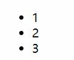
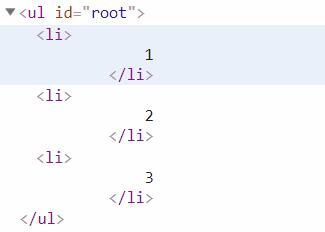
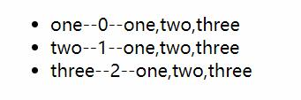
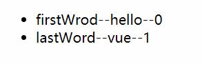
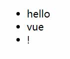
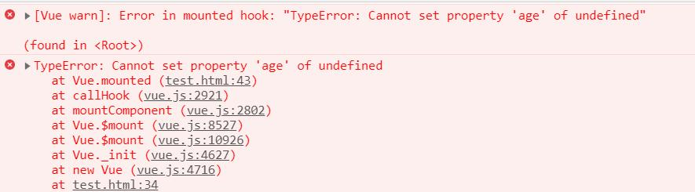
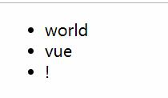

# 使用v-for指令来批量渲染

一个基本的`v-for`指令使用如下:

HTML:
```html
<ul id="root">
    <li v-for="item in list">
        {{ item }}
    </li>
</ul>
```
JavaScript:
```javascript
new Vue({
    el: '#root',
    data: {
        list:[1,2,3]
    }
})
```

__图片:输出内容:__  


__图片:DOM结构:__  


使用`v-for`指令可以迭代一个列表中的内容,迭代的次数取决于列表(数组)的长度.  
在上个例子中我们的数组长度为3,结果中就创建了3个`<p>`标签.

而`v-for="item in list"`中`list`就是需要被迭代的列表(数组),而`item`每次循环时候的具体内容.

## 迭代对象

上个例子中我们演示了`v-for`指令迭代一个列表(数组).

同样的`v-for`指令也可以迭代一个对象:

HTML:
```html
<ul id="root">
    <li v-for="value in obj">
        {{ value }}
    </li>
</ul>
```
JavaScript:
```javascript
new Vue({
    el: '#root',
    data: {
        obj:{
            firstWord:'hello',
            lastWord:'vue'
        }
    }
})
```
输出:
```
· hello
· vue
```

## 额外的参数

在JavaScript原生的数组迭代中有一个`forEach`方法,该方法有着如下的可选参数:
```javascript
[1,2,3].forEach(function(value,index,array){
    // value == 每次循环时候元素的值
    // index == 当前循环的下标
    // array == 数组本身
})
```

`v-for`指令同样提供了上述参数,现在我们来尝试迭代一个**数组**:

HTML:
```html
<ul id="root">
    <li v-for="(item,index) in list">
        {{ item +'--'+ index +'--'+ list }}
    </li>
</ul>
```
JavaScript:
```javascript
new Vue({
    el: '#root',
    data: {
        list:['one','two','three']
    }
})
```

__图片:`v-for`迭代列表使用额外参数效果:__  


上例中:

- item == 元素本身
- index == 元素在数组中的下标

现在我们来尝试一下**对象**的语法:

HTML:
```html
<ul id="root">
    <li v-for="(value,key,index) in obj">
        {{ key +'--'+ value +'--'+ index }}
    </li>
</ul>
```
JavaScript:
```javascript
new Vue({
    el: '#root',
    data: {
        obj:{
            firstWrod:'hello',
            lastWord:'vue'
        }
    }
})
```

__图片:`v-for`迭代对象使用额外参数效果:__  


上例中:
- value == 对象的值
- key == 对象的键
- index == 当前循环的下标

# 特殊属性`key`

还记得第六章中条件渲染中的`key`属性吗,给元素指定一个不唯一的值,告诉Vue他们不是同一个元素来避免元素的复用.

在列表渲染中,也有`key`属性但是含义不同.

实际上这个属性在**最终章**组件的循环渲染一节中key是**必须传递**的,但是非组件循环渲染可以不传递.

## 为什么要使用key

> 当 Vue.js 用 v-for 正在更新已渲染过的元素列表时，它默认用“就地复用”策略。如果数据项的顺序被改变，Vue 将不会移动 DOM 元素来匹配数据项的顺序， 而是简单复用此处每个元素，并且确保它在特定索引下显示已被渲染过的每个元素。`{1}`

- `{1}` 简单的来讲默认的情况下Vue不会去修改DOM来渲染改变后的列表.而是仅仅替换元素的属性或者内部的文本把它变成符合列表的样子.

> 为了给 Vue 一个提示，以便它能跟踪每个节点的身份，从而重用和重新排序现有元素，你需要为每项提供一个唯一 key 属性。理想的 key 值是每项都有的唯一 id。这个特殊的属性相当于 Vue 1.x 的 track-by ，但它的工作方式类似于一个属性，所以你需要用 v-bind 来绑定动态值：

```html
<div v-for="item in items" :key="item.id">
  <!-- 内容 -->
</div>
```
> 建议尽可能在使用 v-for 时提供 key，除非遍历输出的 DOM 内容非常简单，或者是刻意依赖默认行为以获取性能上的提升。

> 因为它是 Vue 识别节点的一个通用机制，key 并不与 v-for 特别关联，key 还具有其他用途，我们将在后面的指南中看到其他用途。

# 数组更新检测

这一章稍显复杂,但是问题的关键是**Vue有时候会在数据改变的时候获取不到更新**.  
一旦Vue获取不到数据的更新那么,也就无法进行响应式渲染.

总得来说,这个问题凸显在两个部分:
1. 运行时修改数组
2. 运行时添加属性

在下面的表格中,我列举了所有的修改**数组**的方法,并且给出了补救策略:
| 修改方法      | 描述             | 是否可以触发响应式 | 补救策略                                             |
| ------------- | ---------------- | ------------------ | ---------------------------------------------------- |
| [0] = 'xxx'   | 利用下标直接赋值 | 否                 | 使用Vue提供的Vue.set()                               |
| [].length='x' | 修改数组的length | 否                 | 同上或者使用vm.items.splice(newLength)               |
| [].push()     | 向数组添加内容   | 是                 |                                                      |
| [].pop()      | 获取数组的内容   | 是                 |                                                      |
| [].shift()    | 获取数组的内容   | 是                 |                                                      |
| [].unshift()  | 向数组添加内容   | 是                 |                                                      |
| [].splice()   | 切割或修改数组   | 是                 |                                                      |
| [].sort()     | 排序数组         | 是                 |                                                      |
| [].reverse()  | 反转数组         | 是                 |                                                      |
| [].filter()   | 过滤数组内容     | 否                 | 获取返回值然后重新赋值 vm.list = vm.list.filter(xxx) |
| [].concat()   | 连接多个数组     | 否                 | 同上                                                 |
| [].slice()    | 切割数组         | 否                 | 同上                                                 |

为了展示问题所在运行如下的例子:

HTML:
```html
<ul id="root">
    <li v-for="item in list">
        {{ item }}
    </li>
</ul>
```
JavaScript:
```javascript
var app = new Vue({
    el: '#root',
    data: {
        list:['hello','vue','!']
    }
});

console.log(app.list[0]); // 输出 hello

app.list[0] = 'world';

console.log(app.list[0]); // 输出 world
```

__图片:直接使用数组下标赋值后的效果:__  


可以看到即使我修改了数组的内容,但是Vue没有进行重新渲染.

---

下面的例子中,我们在执行的时候动态的给`data`中添加一个**属性**:

HTML:
```html
<ul id="root">
    <p v-if="info.name">
        {{ info.name }}
        {{ info.age }}
    </p>
</ul>
```
JavaScript:
```javascript
var app = new Vue({
    el: '#root',
    data: {
        info:{
            name:''
        }
    },
    // mounted -- Vue生命周期钩子函数之一
    mounted:function(){
        this.info.age = 20;
        this.info.name = 'ASCll';
    }
});
```
在这个例子中不仅仅`age`属性无法添加,甚至由于`age`不存在导致报错.

__图片:报错:__  


**补救办法**:使用`Vue.set()`.


## 补救办法详解

### 1. Vue.set()方法的使用实例:

__Vue.set()是Vue的静态方法.__

该方法定义如下:
```
Vue.set( target, key, value )
```
| 键名   | 含义         |
| ------ | ------------ |
| target | 要修改的目标 |
| key    | 目标的键名   |
| value  | 对应键名的值 |

现在我们使用`Vue.set`修复上面**数组**例子中的问题:
```javascript
var app = new Vue({
    el: '#root',
    data: {
        list:['hello','vue','!']
    }
});

console.log(app.list[0]); // hello

Vue.set(app.list,0,'world');

console.log(app.list[0]); // world
```

__图片:使用`Vue.set`后的结果:__  


另外一个例子使用`Vue.set`修复上面**对象**例子中的问题:
```javascript
var app = new Vue({
    el: '#root',
    data: {
        info:{
            name:''
        }
    },
    // mounted -- Vue声明周期钩子函数之一
    mounted:function(){
        Vue.set(this.info,'age',20);
        this.info.name = 'ASCll';
    }
});
```

__图片:使用`Vue.set`后的结果:__  


### 2. 数组的特殊方法

对于JavaScript的数组方法按照操作方式分为两种:

1. 方法在原数组上进行操作
2. 方法不在原数组上进行操作,返回操作后的数组

在分类1中常见的方法有`push`,`pop`等,而第二类就是诸如`filter`,`map`,`concat`等方法.

示例`filter`的解决方式,其余返回数组的方法同理:

HTML:
```html
<ul id="root">
    <p v-for="item in list" >
        {{ item }}
    </p>
</ul>
```
JavaScript:
```javascript
var app = new Vue({
    el: '#root',
    data: {
        list:[20,30,40,50]
    },
    mounted:function(){
        
        var result = this.list.filter(function (value) {
            return value<30;
        });

        console.log(result) // [20]

        this.list = result;
    }
});
```
在最终的输出中最后只有结果小于30的内容留了下来,在这个例子中最后只有20被渲染.

# 显示过滤/排序结果

> 有时，我们想要显示一个数组的过滤或排序副本，而不实际改变或重置原始数据。在这种情况下，可以创建返回过滤或排序数组的计算属性。

HTML:
```html
<li v-for="n in evenNumbers">{{ n }}</li>
```
JavaScript:
```javascript
data: {
  numbers: [ 1, 2, 3, 4, 5 ]
},
computed: {
  evenNumbers: function () {
    return this.numbers.filter(function (number) {
      return number % 2 === 0
    })
  }
}
```

> 在计算属性不适用的情况下 (例如，在嵌套 v-for 循环中) 你可以使用一个 method 方法：

HTML:
```html
<li v-for="n in even(numbers)">{{ n }}</li>
```
JavaScript:
```javascript
data: {
  numbers: [ 1, 2, 3, 4, 5 ]
},
methods: {
  even: function (numbers) {
    return numbers.filter(function (number) {
      return number % 2 === 0
    })
  }
}
```

# 一段取值范围的 v-for

> v-for 也可以取整数。在这种情况下，它将重复多次模板。

```html
<div>
  <span v-for="n in 10">{{ n }} </span>
</div>
```

__图片:重复多次整数__  


# 在`template`上使用`v-for`

在`条件渲染`一章我们使用`<template>`占位元素一次数输出多个占位元素内部的内容.

在`v-for`上同样可以使用`<template>`来渲染多个元素.

HTML:
```html
<ul>
  <template v-for="item in items">
    <li>{{ item.msg }}</li>
    <li class="divider" role="presentation"></li>
  </template>
</ul>
```

# 在`v-for`中的`v-if`

由于Vue有循环和判断的模板语法,难免不难让使用者想到如下的模板写法:

HTML:
```html
<li v-for="todo in todos" v-if="!todo.isComplete">
  {{ todo }}
</li>
```

这是可以运行的Vue会先执行`v-if`判断,判断通过后才会执行`v-for`语句.

在上面的例子中会过滤没有完成的内容的输出.

> 而如果你的目的是有条件地跳过循环的执行，那么可以将 v-if 置于外层元素 (或 `<template>`)上。如：

HTML:
```html
<ul v-if="todos.length">
  <li v-for="todo in todos">
    {{ todo }}
  </li>
</ul>
<p v-else>No todos left!</p>
```

## 为什么不推荐在`v-for`中使用`v-if`

实际上这个问题很简单,在`v-for`中使用`v-if`无非是为了过滤掉一些数据.

这么做有很多坏处:

- 性能低下
- 有多个if的时候模板非常难看
- 完全可以在JavaScript替换掉这种写法

替代方案:

- 定义两个列表,一个存放原始数据,另外一个存放过滤后的数据,`v-for`迭代过滤后的列表.
- 将迭代的内容封装为组件,将逻辑判断交由组件.

