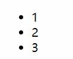
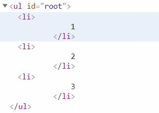

# 简介

本章为部分原创,和官网文档略有差异.

# 使用v-for指令来批量渲染

一个基本的`v-for`指令使用如下:

HTML:
```
<ul id="root">
    <li v-for="item in list">
        {{ item }}
    </li>
</ul>
```
JavaScript:
```
new Vue({
    el: '#root',
    data: {
        list:[1,2,3]
    }
})
```

__图片:输出内容:__  


__图片:DOM结构:__  


使用`v-for`指令可以迭代一个列表中的内容,迭代的次数取决于列表(数组)的长度.  
在上个例子中我们的数组长度为3,结果中就创建了3个`<p>`标签.

而`v-for="item in list"`中`list`就是需要被迭代的列表(数组),而`item`每次循环时候的具体内容.

## 迭代对象

上个例子中我们演示了`v-for`指令迭代一个列表(数组).

同样的`v-for`指令也可以迭代一个对象:

HTML:
```
<ul id="root">
    <li v-for="value in obj">
        {{ value }}
    </li>
</ul>
```
JavaScript:
```
new Vue({
    el: '#root',
    data: {
        obj:{
            firstWord:'hello',
            lastWord:'vue'
        }
    }
})
```
输出:
```
· hello
· vue
```

## 额外的参数

在JavaScript原生的数组迭代中有一个`forEach`方法,该方法有着如下的可选参数:
```
[1,2,3].forEach(function(value,index,array){
    // value == 每次循环时候元素的值
    // index == 当前循环的下标
    // array == 数组本身
})
```

`v-for`指令同样提供了上述参数,现在我们来尝试迭代一个数组:

HTML:
```
<ul id="root">
    <li v-for="(item,index) in list">
        {{ item +'--'+ index +'--'+ list }}
    </li>
</ul>
```
JavaScript:
```
new Vue({
    el: '#root',
    data: {
        list:['one','two','three']
    }
})
```

__图片:`v-for`迭代列表使用额外参数效果:__  


上例中:

- item == 元素本身
- index == 元素在数组中的下标

现在我们来尝试一下对象的语法:

HTML:
```
<ul id="root">
    <li v-for="(value,key,index) in obj">
        {{ key +'--'+ value +'--'+ index }}
    </li>
</ul>
```
JavaScript:
```
new Vue({
    el: '#root',
    data: {
        obj:{
            firstWrod:'hello',
            lastWord:'vue'
        }
    }
})
```

__图片:`v-for`迭代对象使用额外参数效果:__  


上例中:
- value == 对象的值
- key == 对象的键
- index == 当前循环的下标


## 不要和v-if联用

