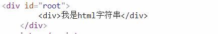
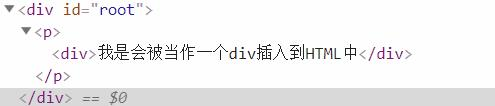

# 简介

在第一章中我们介绍了Vue的模板部分的几个基本语法:

```
{{ msg }}
```
和几个简单的指令:

- v-if
- v-for
- v-modle
- v-bind

在这章中我们会更加深入的讨论Vue的HTML模板部分的特性.

以下是官方文档的HTML模板部分的介绍:

> Vue.js 使用了基于 HTML 的模板语法，允许开发者声明式地将 DOM 绑定至底层 Vue 实例的数据。所有 Vue.js 的模板都是合法的 HTML ，所以能被遵循规范的浏览器和 HTML 解析器解析。

> 在底层的实现上，Vue 将模板编译成虚拟 DOM 渲染函数。结合响应系统，Vue 能够智能地计算出最少需要重新渲染多少组件，并把 DOM 操作次数减到最少。

# 插值`(1)`

- `(1)` 所谓的插值指的就是使用HTML中插入模板符号的这种行为,这种行为会将数据填充到该位置.

## 文本

> 数据绑定最常见的形式就是使用“Mustache”语法 (双大括号) 的文本插值：
```html
<span>Message: {{ msg }}</span>
```
> Mustache 标签将会被替代为对应数据对象上 msg 属性的值。无论何时，绑定的数据对象上 msg 属性发生了改变，插值处的内容都会更新。

> 通过使用 [v-once 指令](https://cn.vuejs.org/v2/api/#v-once)，你也能执行一次性地插值，当数据改变时，插值处的内容不会更新。但请留心这会影响到该节点上的其它数据绑定：

```html
<span v-once>这个将不会改变: {{ msg }}</span>
```

## 原始HTML

在Vue实例中存放的字符串数据如果是HTML格式例如:
```javascript
new Vue({
    el:'#root',
    data:{
        message:'<div>我是html字符串</div>'
    }
});
```
在使用HTML模板部分的时候:
```html
<div id="root" >
    {{ message }}
</div>
```
最后在HTML中实际输出也是字符串,而不是真正的HTML结构,简单的来说你**不可以**使用插值的语法来直接的添加或者修改实际的HTML结构.

__图片:直接输出html字符串:__  


__如何做到?__

做到这点需要使用`v-html`指令,当获取到实际的HTML字符串这个字符串会被转为实际的DOM元素然后成为使用`v-html`指令元素的子元素,例如:
HTML:
```html
<div id="root" >
    <p v-html="message"></p>
</div>
```
JavaScript:
```javascript
new Vue({
    el:'#root',
    data:{
        message:'<div>我是会被当作一个div插入到HTML中</div>'
    }
});
```

__图片:使用`v-html`指令:__  


## 特性`(1)`

 - `(1)` 此处指的是HTML元素的特性,例如HTML元素的属性就是HTML元素的特性之一.

> Mustache(花括号语法)不能作用在 HTML 特性上，遇到这种情况应该使用[v-bind](https://cn.vuejs.org/v2/api/#v-bind)指令：
```html
<div v-bind:id="dynamicId"></div>
```

> 在布尔特性的情况下，它们的存在即暗示为 true，`v-bind` 工作起来略有不同，在这个例子中：
```html
<button v-bind:disabled="isButtonDisabled">Button</button>
<!-- {1} -->
```

 - `{1}` button元素是有`disabled`属性的,此处我们要使用一个boolean类型来控制button是否可用

> 如果 isButtonDisabled 的值是 null、undefined 或 false，则 disabled 特性甚至不会被包含在渲染出来的 `<button>`元素中。

## 使用 JavaScript 表达式

> 迄今为止，在我们的模板中，我们一直都只绑定简单的属性键值。但实际上，对于所有的数据绑定，Vue.js 都提供了完全的 JavaScript 表达式支持。

```html
{{ number + 1 }}

{{ ok ? 'YES' : 'NO' }} // {1}

{{ message.split('').reverse().join('') }}

<div v-bind:id="'list-' + id"></div> // (1)
```

 - `{1}` 该操作是三目运算符,简单来说就是在一行上的if语句
 - `(1)` 在Vue指令中的表达式需要注意引号的问题在JavaScript表达式中`'list-' + id`的`'list'`表示的是字符串,在JavaScript中字符串不区分引号的单引号和双引号,同样的HTML元素的属性也不区分,如果HTML和JavaScript的字符串引号一致就会导致错误.

> 这些表达式会在所属 Vue 实例的数据作用域下作为 JavaScript 被解析。有个限制就是，每个绑定都只能包含单个表达式，所以下面的例子都不会生效。

```html
<!-- 这是语句，不是表达式 -->
{{ var a = 1 }}

<!-- 流控制也不会生效，请使用三元表达式 -->
{{ if (ok) { return message } }}
```

> 模板表达式都被放在沙盒中，只能访问全局变量的一个白名单，如 Math 和 Date 。你不应该在模板表达式中试图访问用户定义的全局变量。

# 指令

> 指令 (Directives) 是带有 `v-` 前缀的特殊特性。指令特性的值预期是单个 `JavaScript` 表达式 (`v-for` 是例外情况，稍后我们再讨论)。指令的职责是，当表达式的值改变时，将其产生的连带影响，响应式地作用于 `DOM`。回顾我们在介绍中看到的例子：

```html
<p v-if="seen">现在你看到我了</p>
```
> 这里，`v-if` 指令将根据表达式 `seen` 的值的真假来插入/移除 `<p>` 元素。

## 参数

> 一些指令能够接收一个“参数”，在指令名称之后以冒号表示。例如，v-bind 指令可以用于响应式地更新 HTML 特性`(1)`：

 - `(1)` 指的就是当实例数据变化时候即时更新HTML元素属性.

```html
<a v-bind:href="url">...</a>
```

在这里 `href` 是参数，告知 `v-bind` 指令将该元素的 `href` 特性与表达式`url`的值绑定,这会让Vue去寻找内部的`url`属性如果不存在则会报错.

> 另一个例子是 `v-on` 指令，它用于监听 `DOM` 事件：

```html
<a v-on:click="doSomething">...</a>
```

> 在这里参数是监听的**事件名**。我们也会更详细地讨论事件处理。

## 修饰符

> 修饰符 (Modifiers) 是以半角句号 `.` 指明的特殊后缀，用于指出一个指令应该以特殊方式绑定。例如，`.prevent` 修饰符告诉 `v-on` 指令对于触发的事件调用 `event.preventDefault()` `{1}`：

 - `{1}` HTML中很多元素是有默认事件的,例如`<a>`元素点击后会进行跳转,如果不想执行默认的行为在传统的JavaScript中需要在事件回调中调用`event.preventDefault()`阻止这种行为.而在Vue中使用`v-on`来进行监听事件,使用`v-on:xxx.prevent`可以起到同样的效果.

```html
<form v-on:submit.prevent="onSubmit">...</form>
```

> 在接下来对 `v-on` 和 `v-for` 等功能的探索中，你会看到修饰符的其它例子。

# 缩写

到目前为止`v2.5.17`,Vue一共提供了两个指令的缩写形式用于减少代码的编写.

- v-on == @
- v-bind == :

例子`v-bind`:
```html
<!-- 完整语法 -->
<a v-bind:href="url">...</a>

<!-- 缩写 -->
<a :href="url">...</a>
```

例子`v-on`:
```html
<!-- 完整语法 -->
<a v-on:click="doSomething">...</a>

<!-- 缩写 -->
<a @click="doSomething">...</a>
```

> 它们看起来可能与普通的 HTML 略有不同，但 : 与 @ 对于特性名来说都是合法字符，在所有支持 Vue.js 的浏览器都能被正确地解析。而且，它们不会出现在最终渲染的标记中。缩写语法是完全可选的，但随着你更深入地了解它们的作用，你会庆幸拥有它们。