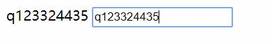
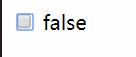
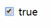
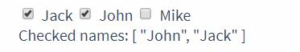
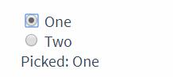
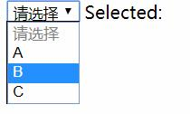
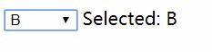
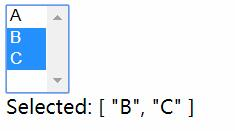

# 表单输入绑定基础

在第一章中我们简单的使用`v-modle`指令,在本章中将会详细的介绍该指令的使用方法.

> 你可以用 `v-model` 指令在表单 `<input>`、`<textarea>` 及 `<select>` 元素上创建双向数据绑定。它会根据控件类型自动选取正确的方法来更新元素。

实际上这种功能无非是在已有的`单向数据绑定`和`事件监听`上的一层封装而已.

在使用`v-model`指令之前,我们首先了解一下`value`属性,因为在这些元素变化的时候通常他的`value`属性也会随着改变.

而Vue的`v-model`指令就是基于`value`属性做出功能包装的.

在下列HTML元素上都是有`value`属性的:
- input
- textarea
- select
- option
- param
- data
- button
- meter
- progress
- li

其中最常使用的就是`<input>`和`<textarea>`还有`<select>`.

**注意**:`v-model` 会忽略所有表单元素的 `value`、`checked`、`selected` 特性的初始值而总是将 Vue 实例的数据作为数据来源。你应该通过 JavaScript 在组件的 `data` 选项中声明初始值。

**注意**:对于需要使用输入法 (如中文、日文、韩文等) 的语言，你会发现 `v-model` 不会在输入法组合文字过程中得到更新。如果你也想处理这个过程，请使用 `input` 事件。

# 文本示例

HTML:
```html
<div id="root">
    {{ inputText }}
    <input type="text" v-model="inputText" >
</div>
```
JavaScript:
```javascript
var example1 = new Vue({
    el: '#root',
    data: {
        inputText:''
    }
})
```

__图片:输入文字后的效果:__  


当`<input>`元素的`value`属性改变的时候(输入内容会改变`<input>`的`value`值)所变化的数据会被Vue同步到`v-model`绑定的属性上.本例中这个属性是`inputText`.

我们输出了这个`inputText`所以当`<input>`输入内容的时候,内部的数据会实时被渲染出来.

## 多行文本示例

HTML:
```html
<div id="root">
    {{ inputText }}
    <textarea type="text" v-model="inputText" ></textarea>
</div>
```
JavaScript:
```javascript
var example1 = new Vue({
    el: '#root',
    data: {
        inputText:''
    }
})
```

多行文本的使用规则和`<input type="text">`没有本质的区别.

# 复选框

## 单个复选框，绑定到布尔值

HTML:
```html
<div id="root">
    <input type="checkbox" id="checkbox" v-model="checked">
    <label for="checkbox">{{ checked }}</label>
</div>
```
JavaScript:
```javascript
var example1 = new Vue({
    el: '#root',
    data: {
        checked:false
    }
})
```

__图片:未选择的效果:__  


__图片:选择后的效果:__  


## 多个复选框，绑定到同一个数组

HTML:
```html
<div id='example-3'>
  <input type="checkbox" id="jack" value="Jack" v-model="checkedNames">
  <label for="jack">Jack</label>
  <input type="checkbox" id="john" value="John" v-model="checkedNames">
  <label for="john">John</label>
  <input type="checkbox" id="mike" value="Mike" v-model="checkedNames">
  <label for="mike">Mike</label>
  <br>
  <span>Checked names: {{ checkedNames }}</span>
</div>
```
JavaScript:
```javascript
new Vue({
  el: '#example-3',
  data: {
    checkedNames: []
  }
})
```

__图片:复选框绑定到一个数组选中其中多个按钮:__  


# 单选按钮

HTML:
```html
<div id="example-4">
  <input type="radio" id="one" value="One" v-model="picked">
  <label for="one">One</label>
  <br>
  <input type="radio" id="two" value="Two" v-model="picked">
  <label for="two">Two</label>
  <br>
  <span>Picked: {{ picked }}</span>
</div>
```
JavaScript:
```javascript
new Vue({
  el: '#example-4',
  data: {
    picked: ''
  }
})
```

和复选框不同的是,单选按钮是给出多个选项然后只能选一个是一个一对多的概念.

也就是说一个变量对应多个值,所以这里`v-model`指令绑定的是同一个值`picked`.

__图片:单选按钮绑定选中其中一个按钮:__  



# 选择框

## 单选选择框

HTML:
```html
<div id="root">
  <select v-model="selected">
    <option disabled value="">请选择</option>
    <option>A</option>
    <option>B</option>
    <option>C</option>
  </select>
  <span>Selected: {{ selected }}</span>
</div>
```
JavaScript:
```javascript
new Vue({
  el: '#root',
  data: {
    selected: ''
  }
})
```

__图片:选择框选择前:__  


__图片:选择框选择后:__  


**警告**:如果 v-model 表达式的初始值未能匹配任何选项，`<select>` 元素将被渲染为“未选中”状态。在 iOS 中，这会使用户无法选择第一个选项。因为这样的情况下，iOS 不会触发 change 事件。因此，更推荐像上面这样提供一个值为空的禁用选项。

## 多选选择框

和复选框一样,对于多选的选择框,最后绑定的结果到一个数组中.

HTML:
```html
<div id="root">
    <select v-model="selected" multiple="multiple" style="width: 50px;">
    <!-- {1} -->
        <option>A</option>
        <option>B</option>
        <option>C</option>
    </select>
    <br>
    <span>Selected: {{ selected }}</span>
</div>
```
JavaScript:
```javascript
new Vue({
    el: '#root',
    data: {
        selected: []
    }
})
```

- `{1}` `<select>`元素的`multiple`属性会让该元素成为多选框.

**注意**:多选框需要按住`ctrl`键才可以进行多选.

__图片:多选框多选:__  


## 选择框结合`v-for`指令

由于`<option>`元素是重复的我们可以利用`v-for`指令来动态的创建或者渲染出一个列表而不是手写.

在下面的这个例子中我们使用`v-for`指令渲染出了一些`<option>`并且利用`v-bind`指令为其添加了`value`属性.

HTML:
```html
<div id="root">
    <select v-model="selected">
        <option v-for="option in options" v-bind:value="option.value">
            {{ option.text }}
        </option>
    </select>
    <span>Selected: {{ selected }}</span>
</div>
```
JavaScript:
```javascript
new Vue({
    el: '#root',
    data: {
        selected: 'A', // 初始值
        options: [
            { text: 'One', value: 'A' },
            { text: 'Two', value: 'B' },
            { text: 'Three', value: 'C' }
        ]
    }
})
```

# 值绑定`(1)`

- `(1)` 指的是使用`v-model`指定绑定的`value`属性在不同元素中具体的使用规则.

> 对于**单选按钮**，**复选框**及**选择框**的选项，`v-model` 绑定的值通常是静态字符串 (对于复选框也可以是布尔值)：

```html
<!-- 当选中时，`picked` 为字符串 "a" -->
<input type="radio" v-model="picked" value="a">

<!-- `toggle` 为 true 或 false -->
<input type="checkbox" v-model="toggle">

<!-- 当选中第一个选项时，`selected` 为字符串 "abc" -->
<select v-model="selected">
  <option value="abc">ABC</option>
</select>
```

## 复选框

```html
<input
  type="checkbox"
  v-model="toggle"
  true-value="yes"
  false-value="no"
>
<!-- (1) -->
```
- `(1)` 此处的`true-value`和`false-value`在我查询HTML5标准后发现没有该属性,可以断定该属性由Vue定义.
```javascript
// 当选中时
vm.toggle === 'yes'
// 当没有选中时
vm.toggle === 'no'
```

**注意**:请注意这个例子和普通多选框的区别,在之前的复选框例子中我们只能获取`true`和`false`但是现在我们可以自定义为其他类型的内容.

> 这里的 `true-value` 和 `false-value` 特性并不会影响输入控件的 `value` 特性，因为浏览器在提交表单时并不会包含未被选中的复选框。如果要确保表单中这两个值中的一个能够被提交，(比如“yes”或“no”)，请换用单选按钮。

## 单选按钮

```html
<input type="radio" v-model="pick" v-bind:value="a">
```
```javascript
// 当选中时
vm.pick === vm.a
```

**注意**:请注意这个例子和之前的单选按钮的区别,在之前的例子中单选按钮的选择或者未选择只能是`true`和`false`但是这里我们使用`v-bind:value="a"`将它点击后的效果变成了字符串.

## 选择框的选项

之前的`选择框结合`v-for`指令`一节中我们已经使用`v-bind`给选择框的每一项添加了一个不是`true`和`false`的值.

在这个例子中他甚至可以是一个对象.

```html
<select v-model="selected">
    <!-- 内联对象字面量 -->
  <option v-bind:value="{ number: 123 }">123</option>
</select>
```
```javascript
// 当选中时
typeof vm.selected // => 'object'
vm.selected.number // => 123
```

**注意**:实际上无论是 `单选按钮` `复选框` 还是 `选择框` 的值绑定都可以是`Number`,`String`,`Boolean`,`Object`的字面量.

# 修饰符

在第八章中我们介绍了事件的修饰符,在`v-model`指令上也有常用的修饰符.

## .lazy

> 在默认情况下，`v-model` 在每次 `input` 事件触发后将输入框的值与数据进行同步 (除了上述输入法组合文字时)。你可以添加 `lazy` 修饰符，从而转变为使用 `change` 事件进行同步.`{1}`

- `{1}` 你需要了解JavaScript中`input`和`change`事件的区别,简单的来说使用这个修饰符后`v-modle`绑定数据的获取只有在数据被彻底改变后才会改变.例如在输入框中输入完成内容后再空白区域点击左键,会被视为`change`事件.

```html
<!-- 在“change”时而非“input”时更新 -->
<input v-model.lazy="msg" >
```

## .number

> 如果想自动将用户的输入值转为数值类型，可以给 `v-model` 添加 `number` 修饰符：

```html
<input v-model.number="age" type="number">
```

> 这通常很有用，因为即使在 `type="number"` 时，HTML 输入元素的值也总会返回字符串。如果这个值无法被 `parseFloat()` 解析，则会返回原始的值。

## .trim

> 如果要自动过滤用户输入的首尾空白字符，可以给 `v-model` 添加 `trim` 修饰符：

```html
<input v-model.trim="msg">
```