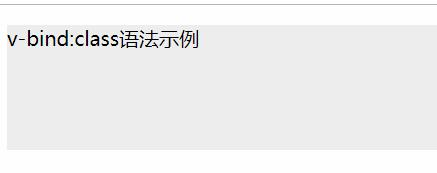
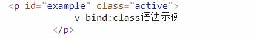
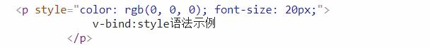

# 简介

在本章主要介绍如何利用Vue的数据绑定的功能也就是`v-bind`处理`class`和`style`属性.

HTML的所有元素上的属性都可以使用`v-bind`的指令进行处理,其中`class`和`style`最为特殊,因为他们涉及到了最基础的样式操作,所以Vue对于添加了更加强大的功能.

**注意**:下面的例子默认会包含如下的样式:
```css
#example{
    height:100px;
}

.active{
    background-color:#eee;
}

.info{
    border:2px solid blue;
}
```

> 操作元素的 class 列表和内联样式是数据绑定的一个常见需求。因为它们都是属性，所以我们可以用 v-bind 处理它们：只需要通过表达式计算出字符串结果即可。不过，字符串拼接麻烦且易错。因此，在将 v-bind 用于 class 和 style 时，Vue.js 做了专门的增强。表达式结果的类型除了字符串之外，还可以是对象或数组。

# 绑定 HTML Class

## 对象语法 

> 我们可以传给 v-bind:class 一个对象，以动态地切换 class：
```html
<div v-bind:class="{ active: isActive }"></div>
```

上面的语法可以被解释为如下的表格:

| 要动态添加的类名   | 如果布尔运算为true则添加这个类名 |
| ------------------ | -------------------------------- |
| active             | isActive                         |

然后我们把它放到实际的代码中运行:

HTML:
```html
<div id="root">
    <p id="example" v-bind:class="{active:isActive}">
        v-bind:class语法示例
    </p>
</div>
```
JavaScript:
```javascript
new Vue({
    el: '#root',
    data: {
        isActive:true
    }
})
```

__图片:使用class绑定后的效果:__  


__图片:使用class绑定后的DOM结构:__  



### 多个类名切换的示例

**注意**:如果元素上之前就有类名,那么Vue是不会修改元素的默认类名的.

HTML:
```html
<div id="root">
    <p id="example" class="default"  v-bind:class="{active:isActive,info:hasInfo}">
        v-bind:class语法示例
    </p>
</div>
```
JavaScript:
```javascript
new Vue({
    el: '#root',
    data: {
        isActive: true,
        hasInfo:true,
    }
})
```

__图片:多个class的效果:__  


__图片:多个Class和默认类名DOM结构:__  


### 将class绑定的对象移动到Vue实例中

`v-bind:class="{active:isActive,info:hasInfo}"`中的`{active:isActive,info:hasInfo}`可以单独拿出来在`data`中定义为一个对象.

现在我们来改写上面的例子:

HTML:
```html
<div id="root">
    <p id="example" class="default"  v-bind:class="myClass">
        v-bind:class语法示例
    </p>
</div>
```
JavaScript:
```javascript
new Vue({
    el: '#root',
    data: {
        myClass: {
            active: true,
            info: true
        }
    }
})
```

最后的结果是和上面的例子一样的.

## 数组语法

> 我们可以把一个数组传给 v-bind:class，以应用一个 class 列表：

HTML:
```html
<div v-bind:class="[activeClass, errorClass]"></div>
```
JavaScript:
```javascript
data: {
  activeClass: 'active',
  errorClass: 'text-danger'
}
```
输出:
```html
<div class="active text-danger"></div>
```

# 绑定内联样式`{1}`

- 指的是以HTML元素的`style`属性编写的css样式

## 对象语法

> v-bind:style 的对象语法十分直观——看着非常像 CSS，但其实是一个 JavaScript 对象。CSS 属性名可以用驼峰式 (camelCase) 或短横线分隔 (kebab-case，记得用单引号括起来) 来命名`{1}`：

 - `{1}` 由于在css中诸如`border-color`这种带有短横线的属性是不可以直接作为JavaScript的对象的键的,必须改为`'border-color'`才可以作为对象的键,此类使用短横线分割的语法可以使用驼峰写法替换,例如`border-color` == `borderColor` 而 `border-style` == `borderStyle`.

例子:

HTML:
```html
<div id="root">
    <p v-bind:style="{color:'#000',fontSize:fz+'px'}">
        v-bind:style语法示例
    </p>
</div>
```
JavaScript:
```javascript
new Vue({
    el: '#root',
    data: {
        fz:20
    }
})
```

对象和css之间的关系:
| 对象键名 | css属性   | 对象值      | css值 |
| -------- | --------- | ----------- | ----- |
| color    | color     | '#000'      | #000  |
| fontSize | font-size | fz+'px'     | 20px  |

__图片:使用v-bind后上例的DOM结构:__  


## 数组语法

和**class绑定**中的数组语法相同.

故此处只提供官方文档中的例子.

> v-bind:style 的数组语法可以将多个样式对象应用到同一个元素上：

```html
<div v-bind:style="[baseStyles, overridingStyles]"></div>
``` 

## 自动添加前缀

> 当 v-bind:style 使用需要添加浏览器引擎前缀的 CSS 属性时，如 transform，Vue.js 会自动侦测并添加相应的前缀。

## 多重值`v2.3.0+`


> 从 2.3.0 起你可以为 style 绑定中的属性提供一个包含多个值的数组，常用于提供多个带前缀的值，例如：

```html
<div :style="{ display: ['-webkit-box', '-ms-flexbox', 'flex'] }"></div>
```

> 这样写只会渲染数组中最后一个被浏览器支持的值。在本例中，如果浏览器支持不带浏览器前缀的 flexbox，那么就只会渲染 display: flex。

