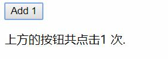

# 监听事件

> 可以用 v-on 指令监听 DOM 事件，并在触发时运行一些 JavaScript 代码。
 
首先我们来看一下在`v-on`指令处使用表达式的例子:

HTML:
```html
<div id="root">
  <button v-on:click="counter += 1">Add 1</button>
  <p>上方的按钮共点击{{ counter }} 次.</p>
</div>
```
JavaScript:
```javascript
var example1 = new Vue({
  el: '#root',
  data: {
    counter: 0
  }
})
```

__图片:基本的Click事件实例__  


# 事件处理方法

Vue监听HTML元素的事件和传统的JavaScript稍有不同,有相似点也有不同点.

- 不同点
    - 使用指令来添加事件监听器
- 相同点
    - 都需要定义一个回调函数且都有一个`Event`参数

官方示例:
```html
<div id="root">
  <!-- `greet` 是在下面定义的方法名 -->
  <button v-on:click="greet">Greet</button>
</div>
```
JavaScript:
```javascript
var example2 = new Vue({
  el: '#root',
  data: {
    name: 'Vue.js'
  },
  // 在 `methods` 对象中定义方法
  methods: {
    greet: function (event) {
      // `this` 在方法里指向当前 Vue 实例
      alert('Hello ' + this.name + '!')
      // `event` 是原生 DOM 事件
      if (event) {
        alert(event.target.tagName)
      }
    }
  }
})

// 也可以用 JavaScript 直接调用方法
example2.greet() // => 'Hello Vue.js!'
```

# 内联处理器中的方法`(1)`

- `(1)` 指的是在`v-on`中使用JavaScript表达式触发Vue实例方法的一种方法.

官方示例:

HTML:
```html
<div id="root">
  <button v-on:click="say('hi')">Say hi</button>
  <button v-on:click="say('what')">Say what</button>
</div>
```
JavaScript:
```javascript
new Vue({
  el: '#root',
  methods: {
    say: function (message) {
      alert(message)
    }
  }
})
```

这种方式允许我们向我们已经定义好的方法传入参数而不是使用默认参数.

但是我们依然可以在传入参数我们的参数的同时,传入事件的`Event`对象,具体示例如下:

HTML:
```html
<button v-on:click="warn('Form cannot be submitted yet.', $event)">
  Submit
</button>
```
JavaScript:
```javascript
// ...
methods: {
  warn: function (message, event) {
    // 现在我们可以访问原生事件对象
    if (event) event.preventDefault()
    alert(message)
  }
}
```
使用方式就是类似于调用方法,本例中第一个参数为固定的字符串,而第二个参数则是`$event`,而这个`$event`指的就是该事件的`Event`对象.

# 事件修饰符

> 在事件处理程序中调用 `event.preventDefault()` `{1}` 或 `event.stopPropagation()` `{2}` 是非常常见的需求。尽管我们可以在方法中轻松实现这点，但更好的方式是：方法只有纯粹的数据逻辑，而不是去处理 DOM 事件细节。

- `{1}` 用于拦截元素的默认事件
- `{2}` 用于禁止元素事件冒泡

> 为了解决这个问题，Vue.js 为 `v-on` 提供了**事件修饰符**。之前提过，修饰符是由点开头的指令后缀来表示的。

- .stop 用于禁止元素事件冒泡
- .prevent 用于拦截元素的默认事件
- .capture 用于优先使用事件捕获
- .self 用于代表元素自身
- .once 用于表示事件只触发一次
- .passive 用于不会阻止默认事件

对应的解释:
```html
<!-- 阻止单击事件继续传播 -->
<a v-on:click.stop="doThis"></a>

<!-- 提交事件不再重载页面 -->
<form v-on:submit.prevent="onSubmit"></form>

<!-- 修饰符可以串联 -->
<a v-on:click.stop.prevent="doThat"></a>

<!-- 只有修饰符 -->
<form v-on:submit.prevent></form>

<!-- 添加事件监听器时使用事件捕获模式 -->
<!-- 即元素自身触发的事件先在此处理，然后才交由内部元素进行处理 -->
<div v-on:click.capture="doThis">...</div>

<!-- 只当在 event.target 是当前元素自身时触发处理函数 -->
<!-- 即事件不是从内部元素触发的 -->
<div v-on:click.self="doThat">...</div>
```

> 使用修饰符时，顺序很重要；相应的代码会以同样的顺序产生。因此，用 `v-on:click.prevent.self` 会阻止所有的点击，而 `v-on:click.self.prevent` 只会阻止对元素自身的点击。

**注意**:`.prevent`和`passive`两者不可以同时使用.

# 按键修饰符

**注意**:这节属于了解内容,所有内容均来自官方文档.

> 在监听键盘事件时，我们经常需要检查常见的键值。Vue 允许为 v-on 在监听键盘事件时添加按键修饰符：

```html
<!-- 只有在 `keyCode` 是 13 时调用 `vm.submit()` -->
<input v-on:keyup.13="submit">
```

> 记住所有的 keyCode 比较困难，所以 Vue 为最常用的按键提供了别名：

```html
<!-- 同上 -->
<input v-on:keyup.enter="submit">

<!-- 缩写语法 -->
<input @keyup.enter="submit">
```

> 全部的按键别名：

- .enter
- .tab
- .delete (捕获“删除”和“退格”键)
- .esc
- .space
- .up
- .down
- .left
- .right

## 自动匹配按键修饰符`v2.5.0+`

> 你也可直接将 `KeyboardEvent.key` 暴露的任意有效按键名转换为 `kebab-case` `(1)` 来作为修饰符：

- `(1)` 指的是使用短横线连接的语法例如下面的`page-down`.

```html
<input @keyup.page-down="onPageDown">
```

> 在上面的例子中，处理函数仅在 $event.key === 'PageDown' 时被调用。

**注意**:有一些按键 (.esc 以及所有的方向键) 在 IE9 中有不同的 key 值, 如果你想支持 IE9，它们的内置别名应该是首选。

## 系统修饰键

> 可以用如下修饰符来实现仅在按下相应按键时才触发鼠标或键盘事件的监听器。

- .ctrl
- .alt
- .shift
- .meta

**注意**:在 Mac 系统键盘上，meta 对应 command 键 (⌘)。在 Windows 系统键盘 meta 对应 Windows 徽标键 (⊞)。在 Sun 操作系统键盘上，meta 对应实心宝石键 (◆)。在其他特定键盘上，尤其在 MIT 和 Lisp 机器的键盘、以及其后继产品，比如 Knight 键盘、space-cadet 键盘，meta 被标记为“META”。在 Symbolics 键盘上，meta 被标记为“META”或者“Meta”。

例如：
```html
<!-- Alt + C -->
<input @keyup.alt.67="clear">

<!-- Ctrl + Click -->
<div @click.ctrl="doSomething">Do something</div>
```

**注意**:请注意修饰键与常规按键不同，在和 keyup 事件一起用时，事件触发时修饰键必须处于按下状态。换句话说，只有在按住 ctrl 的情况下释放其它按键，才能触发 keyup.ctrl。而单单释放 ctrl 也不会触发事件。如果你想要这样的行为，请为 ctrl 换用 keyCode：keyup.17。

## `.exact` 修饰符`v2.5.0+`

> .exact 修饰符允许你控制由精确的系统修饰符组合触发的事件。

```html
<!-- 即使 Alt 或 Shift 被一同按下时也会触发 -->
<button @click.ctrl="onClick">A</button>

<!-- 有且只有 Ctrl 被按下的时候才触发 -->
<button @click.ctrl.exact="onCtrlClick">A</button>

<!-- 没有任何系统修饰符被按下的时候才触发 -->
<button @click.exact="onClick">A</button>
```
## 鼠标按钮修饰符

- .left
- .right
- .middle

>　这些修饰符会限制处理函数仅响应特定的鼠标按钮。