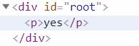
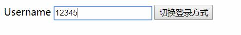
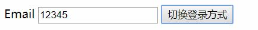

# v-if

在第一章中我们已经简单的介绍了`v-if`指令的使用,实际上那就是`v-if`的所有内容.

但是不是条件渲染的全部内容.

`v-if`指令在条件为真的时候渲染内容.

HTML:
```html
<div id="root">
    <p v-if="ok">yes</p>
</div>
```
JavaScript:
```javascript
new Vue({
    el: '#root',
    data: {
        ok:true
    }
})
```

__图片:使用v-if后的DOM结构:__  


也可以用 v-else 添加一个“else 块”:
```html
<p v-if="ok">Yes</p>
<p v-else>No</p>
```

## 在 `<template>` `(1)` 元素上使用 v-if 条件渲染分组

- `(1)` `<tempalte></template>`在Vue中目前来说`template`元素被视为一种没有具体功能也不会被渲染的占位元素.

> 因为 v-if 是一个指令，所以必须将它添加到一个元素上。但是如果想切换多个元素呢？此时可以把一个 `<template>` 元素当做不可见的包裹元素，并在上面使用 v-if。最终的渲染结果将不包含 `<template>` 元素。

```html
<template v-if="ok">
  <h1>Title</h1>
  <p>Paragraph 1</p>
  <p>Paragraph 2</p>
</template>
```

## v-else

> 你可以使用 v-else 指令来表示 v-if 的“else 块”：

```html
<div v-if="Math.random() > 0.5">
  Now you see me
</div>
<div v-else>
  Now you don't
</div>
```

> v-else 元素必须紧跟在带 v-if 或者 v-else-if 的元素的后面，否则它将不会被识别。

## v-else-if`(v2.1.0+)`

> v-else-if，顾名思义，充当 v-if 的“else-if 块”，可以连续使用：

```html
<div v-if="type === 'A'">
  A
</div>
<div v-else-if="type === 'B'">
  B
</div>
<div v-else-if="type === 'C'">
  C
</div>
<div v-else>
  Not A/B/C
</div>
```

> 类似于 v-else，v-else-if 也必须紧跟在带 v-if 或者 v-else-if 的元素之后。

## 用 key(属性) 管理可复用的元素

在未介绍key属性之前,我们先来看一段`v-if`的使用:

HTML:
```html
<div id="root">
    <template v-if="loginType === 'username'">
        <label>Username</label>
        <input placeholder="输入帐号">
    </template>
    <template v-else>
        <label>Email</label>
        <input placeholder="输入邮箱">
    </template>
    <button v-on:click="toggle" >切换登录方式</button>
</div>
```
JavaScript:
```javascript
new Vue({
    el: '#root',
    data: {
        loginType:'username'
    },
    methods:{
        toggle:function(){
            this.loginType = this.loginType == 'username'?'email':'username';
        }
    }
})
```
这个简单的实例用于切换两种登录方式,我们看一下运行后的效果:

__图片:切换前:__  


__图片:切换后:__  


你发现出问题没有,输入框中的文字被保留了下来.

> Vue 会尽可能高效地渲染元素，通常会复用已有元素而不是从头开始渲染。这么做除了使 Vue 变得非常快之外，还有其它一些好处。

> 那么在上面的代码中切换 loginType 将不会清除用户已经输入的内容。因为两个模板使用了相同的元素，`<input>` 不会被替换掉——仅仅是替换了它的 placeholder。

> 这样也不总是符合实际需求，所以 Vue 为你提供了一种方式来表达“这两个元素是完全独立的，不要复用它们”。只需添加一个具有唯一值的 key 属性即可：

HTML:
```html
<div id="root">
    <template v-if="loginType === 'username'">
        <label>Username</label>
        <input placeholder="输入帐号" key="username-input">
    </template>
    <template v-else>
        <label>Email</label>
        <input placeholder="输入邮箱" key="email-input">
    </template>
    <button v-on:click="toggle" >切换登录方式</button>
</div>
```
现在`<input>`元素不会被复用因为`key`元素标识了这两个`<input>`是不同的元素不会被复用.

但是本例中的`<label>`元素依然会被复用.

# v-show

> 另一个用于根据条件展示元素的选项是 v-show 指令。用法大致一样：

```html
<h1 v-show="ok">Hello!</h1>
```

> 不同的是带有 v-show 的元素始终会被渲染并保留在 DOM 中。v-show 只是简单地切换元素的 CSS 属性 display`(1)`。

- 简单的来说`v-if`和`v-show`都有控制元素是否'显示'的功能,但是`v-if`如果为false这个元素甚至都不会被创建,而`v-show`是将元素创建后隐藏.

**注意**:`v-show`不支持 `<template>`元素,也不支持`v-else`。


## v-if vs v-show

> v-if 是“真正”的条件渲染，因为它会确保在切换过程中条件块内的事件监听器和子组件适当地被销毁和重建。

> v-if 也是惰性的：如果在初始渲染时条件为假，则什么也不做——直到条件第一次变为真时，才会开始渲染条件块。

> 相比之下，v-show 就简单得多——不管初始条件是什么，元素总是会被渲染，并且只是简单地基于 CSS 进行切换。

> 一般来说，v-if 有更高的切换开销`{1}`，而 v-show 有更高的初始渲染开销`{1}`。因此，如果需要非常频繁地切换，则使用 v-show 较好；如果在运行时条件很少改变，则使用 v-if 较好。

- 在DOM修改中创建和移除一个DOM元素的成本要远远高于修改一个元素的`display`属性,但是DOM元素的多少决定着内存占用.

