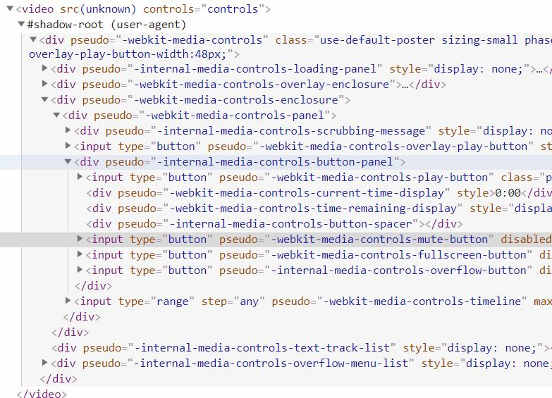
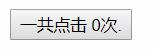
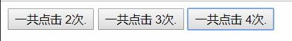
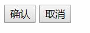
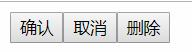
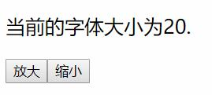
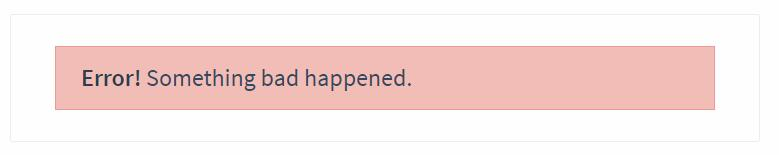
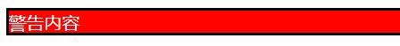
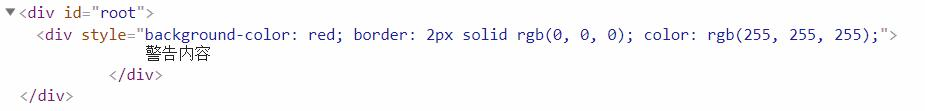

# 简介

组件(Component)可谓是Vue最核心的功能在目前流行的三天Web框架中`Vue`,`AngularJS`,`React`中都有他的身影.

组件就是Vue实例只不过在参数选项上稍有不同,因为侧重点不同,Vue实例侧重于功能,而组件侧重于复用性.

使用Vue书写一张或者一部分页面,不可能不使用组件,所以说**组件是必知必会的部分**.

在了解了学习组件的重要性后,我们回顾在第一章中组件入门的一张中官网文档中对组件的解释:

> 组件系统是 Vue 的另一个重要概念，因为它是一种抽象，允许我们使用小型、独立和通常可复用的组件构建大型应用。仔细想想，几乎任意类型的应用界面都可以抽象为一个组件树.

现在我们使用一种全新的解释方式说明一下使用组件的具体好处.

浏览器给我们提供了许多HTML标签,其中有一类很特殊就是自带有功能的元素,例如按钮,每当我们在HTML中添加如下的代码后:
```html
<button>我是按钮</button>
```
网页上就会出现一个按钮,当然不同浏览器之间的显示效果不同,但是最终都会出现一个按钮.

这一切看似非常自然,自然到我们都不会去思考浏览器背后做了什么,问题如下:

- 按钮为什么会有样式?
- 向元素传递的字符参数为什么会在按钮上显示?
- 为什么会有点击事件(对于button不明显),如果是一个`<audio>`元素为什么会有`play`事件?

实际上带有默认功能和样式的HTML元素并不是操作系统填入的东西,而是浏览器自身就有的而且他们也是使用:

- HTML
- Css
- JavaScript

写出来的只不过是隐藏了他们的具体结构,他们被定义为了浏览器的自带元素,这类元素被称为`shadow element`.

在`chrome v71`中我添加了一个`<video>`元素,然后再开发者控制台中设置运行该元素的`shadow`部分可见:

__图片:空的video元素在页面中的效果:__  


__图片:空的video元素的背后的HTML结构:__  


`<video>`和`<button>`在背后做了很多工作,但是在我们使用它的时候仅仅写几个单词就可以使用了,这就是**浏览器原生的组件的概念.**

Vue组件的基本概念就是:允许你利用它的强大特性在Vue的作用范围内定义一个你的HTML标签,这个标签拥有它自己的功能,一旦这个组件被定义好功能,继续使用组件就在使用一个HTML标签.这样带来的好处就是**复用性**我们可以多次的使用这个标签而不用去修改代码.

# 基本示例

注册一个组件和创建一个Vue实例十分相似:

```javascript
// 定义一个名为 button-counter 的新组件
Vue.component('button-counter', {
  data: function () {
    return {
      count: 0
    }
  },
  template: '<button v-on:click="count++">一共点击 {{ count }}次.</button>'
})
```

对比新建一个Vue实例,创建一个Vue组件有如下的不同:
- 使用Vue.component()创建
- 没有el选项
- data不在是一个对象字面量而是一个函数返回一个对象字面量
- 多了一个template选项内部填充的是HTML字符串

> **组件是可复用的 Vue 实例**，且带有一个名字：在这个例子中是 <button-counter>。我们可以在一个通过 new Vue 创建的 Vue 根实例中，把这个组件作为自定义元素来使用：

HTML:
```html
<div id="root">
  <button-counter></button-counter>
</div>
```
JavaScript:
```javascript
new Vue({ el: '#root' })
```

__图片:使用组件:__  


# 组件的复用

> 你可以将组件进行任意次数的复用:

```html
<div id="root">
  <button-counter></button-counter>
  <button-counter></button-counter>
  <button-counter></button-counter>
</div>
```

这样一来页面中就会出现3个按钮.

__图片:三个按钮分别点击后的效果:__  


我们创建了3个组件,但是每个组件内部的数据是不同的,所以他们展示的数据是不一样的.当你每次使用一个组件都会有一个新的Vue实例产生.

# `data` 必须是一个函数

> 当我们定义这个 `<button-counter>` 组件时，你可能会发现它的 `data` 并不是像这样直接提供一个对象:

```javascript
data: {
  count: 0
}
```
> 取而代之的是，**一个组件的 `data` 选项必须是一个函数**，因此每个实例可以维护一份被返回对象的独立的拷贝`(1)`:

- 函数每次返回的`data`都不是同一个,这些返回的对象的地址都是不相同的,虽然结构是一样的

```javascript
data: function () {
  return {
    count: 0
  }
}
```

如果没有这条规则,那么有多个同一个组件当其中一个组件的数据变化后其余的都会随之变化.

# 组件的`template`

一个组件如下:
```javascript
Vue.component('button-counter', {
  data: function () {
    return {
      count: 0
    }
  },
  template: '<button v-on:click="count++">一共点击 {{ count }}次.</button>'
})
```
都会有一个`template`属性`template`有很多种用法,无论那种用法都是用于告诉组件处理HTML内容的范围.

**注意**:`template`对于的HTML只能有一个根元素,也就是说:

这个是可以的:
```
template: '<button>一个按钮</button>'
```
但是这个就不可以:
```
template: '<button>一个按钮</button><button>两个按钮</button>'
```
对于上面的解决方案就是使用一个元素将两个`<button>`进行包裹起来:
```
template: '<div><button>一个按钮</button><button>两个按钮</button></div>'
```

# 组件的组织

> 通常一个应用会以一棵嵌套的组件树的形式来组织:

__图片:页面结构对应的组件结构:__  


例如在一个常见的网页页面中经常有如下的元素我们把它拆分一下:

- 导航栏
    - 搜索框
    - 链接
    - 按钮
    - 下列菜单
- 侧边栏
    - 按钮
    - 链接
    - 按钮
- 内容区域
    - 文章背景区域
    - 按钮
    - 链接
- 页尾
    - 背景区域
    - 链接
    - 按钮

如果上述的所有内容都是组件的话,现在它们还不够完善:

1. 没有被挂载到Vue实例
2. 还不够细化,还可以更加细化

完善后:

- Vue实例
    - 导航栏
        - 搜索框
            - 按钮
            - 输入框
        - 链接
        - 按钮
        - 下列菜单
            - 按钮
            - 链接
    - 侧边栏
        - 按钮
        - 链接
    - 内容区域
        - 文章区域
            - 标准背景区域
        - 按钮
        - 链接
    - 页尾
        - 页尾信息区域
            - 标准背景区域
        - 链接
        - 按钮

> 为了能在模板中使用，这些组件必须先注册以便 Vue 能够识别。这里有两种组件的注册类型：**全局注册**和**局部注册**。至此，我们的组件都只是通过 `Vue.component` 全局注册的：

```javascript
Vue.component('my-component-name', {
  // ... options ...
})
```

> 全局注册的组件可以用在其被注册之后的任何 (通过 new Vue) 新创建的 Vue 根实例，也包括其组件树中的所有子组件的模板中。

**注意**:在全局注册的情况下,如果一个组件(a)被另外一个组件(b)依赖,那么(a)的注册一定要在(b)的前面,而Vue实例的创建一定是最后一个.

# 向子组件传递数据

当我们定义了一个组件后,很多的情况下父组件(实例)都会向他传递一些数据.

例如:我们定义了一个按钮组件,这个按钮组件其中的字符串展示是由父元素的传入的字符串决定的.

实际上定义组件变得更像定义一个函数(伪代码):

```javascript
function button(str){
    console.log('button上的内容是'+str);
}
button('确认');
```

组件想要接受数据需要使用他的`props`选项,这个选项就好像函数的参数列表一样,允许父组件(实例)传入参数:

HTML:
```html
<div id="root">
    <my-button str="确认" ></my-button>
    <my-button str="取消" ></my-button>
</div>
```
JavaScript:
```javascript
Vue.component('my-button', {
    props:['str'],
    template: '<button> {{ str }} </button>'
})

new Vue({ el: '#root' })
```

__图片:使用`props`:__  


在上面的例子中`props:['str']`数组定义的字符串内容就是参数的名称,当然可以定义多个参数.而`str="确认"`和`str="取消"`就类似于调用函数时候传入的参数.

**注意**:使用`str="xxx"`的方式的时候无论`xxx`是具体的什么内容都将被视为字符串,如果想传入一些固定的内容非字符串内容需要使用`v-bind`例如传递一个对象`v-bind:str="{str:xxx}"`.

而`props`有一个特性和`data`一样,就是`props`中定义的参数在`template`中可以获取到上例中我们在`<button>`中输出了这个字符串.

假设我们有一个数组中保存了所有的按钮的名字,我们可以`v-for`指令进行批量渲染.

在下面这个例子中我们将会接触到:

- 在组件上使用`v-for`
- 在循环中使用`key`属性
- 在组件上使用`v-bind`
- Vue实例和组件的数据交互

**注意**:`v-bind`的简写为`:`下面的例子中将使用简写.

HTML:
```html
<div id="root">
    <my-button v-for="item in buttonList" :str="item.str" :key="item.id" ></my-button>
</div>
```
JavaScript:
```javascript
Vue.component('my-button', {
    props: ['str'],
    template: '<button> {{ str }} </button>'
});

new Vue({
    el: '#root',
    data:{
        buttonList:[{
            id:0,
            str:'确认'
        },{
            id:1,
            str:'取消'
        },{
            id:2,
            str:'删除'
        }]
    }
});
```

__图片:使用数组创建一个按钮组:__  


# 通过事件向父级组件发送消息

在本例中你会了解到:
- 子组件如何与父组件(实例)进行通信
- 动态的修改样式
- Vue实例监听组件的事件
- 组件监听元素事件
- 使用`this.xxx`的形式获取`props`的值

**注意**:本例中监听方法使用简写形式`v-on`的简写形式为`@`.
**注意**:定义方法的过程已经在第一章和第八章中提及.

我们有一个文章区域,旁边有两个按钮,一个是用于放大文章区域的字体,另外一个是缩小文章区域的字体.

HTML:
```html
<div id="root">
    <p :style="{fontSize:fz+'px'}">
        当前的字体大小为{{ fz }}.
    </p>
    <my-button 
    v-for="item in buttonList" 
    :str="item.str" 
    :key="item.id"
    @zoom="zoomHandle"
        ></my-button>
</div>
```
JavaScript:
```javascript
Vue.component('my-button', {
    props: ['str'],
    methods:{
        clickHandle:function(){
            this.$emit('zoom',this.str);
        }
    },
    template: '<button @click="clickHandle"> {{ str }} </button>'
});

new Vue({
    el: '#root',
    data:{
        fz:20,
        buttonList:[
            {id:0,str:'放大'},
            {id:1,str:'缩小'}
            ]
    },
    methods:{
        zoomHandle:function(str){
            if(str=='放大'){
                this.fz+=10;
            }else if(str=='缩小'){
                this.fz-=10;
            }
        }
    }
});
```

__图片:放大缩小文章内容:__  


这个例子看似复杂,实际上相当简单,总共分为3步:
1. 本例中的`<my-button>`组件要监听模板字符串(tempate)中的`<input>`元素的`click`事件,否则他无法知道自己是否被点击.
2. 在`<my-button>`监听到被点击后,调用`this.$emit('zoom',this.str)`触发一个名字叫做`zoom`的事件,这个事件有一个参数`str`以便让父元素判断是放大还是缩小.
3. 父元素监听`<my-button>`的`zoom`事件,根据`zoom`事件传递过来的参数判断是放大还是缩小然后修改自己内部的数据.

补充:
- 上文说道`props`和`data`一样可以用于模板渲染,不仅如此`props`同样的可以使用`this.xxx`的方式进行获取.
- `$emit`是Vue的实例方法之一.


# 通过插槽`(1)`分发内容

- 插槽(slot)具体指的是渲染的出口,或者简单理解就是输出字符串的位置,而这个语法是在子组件中定义使用起来就像插座的入口一样.

> 和 HTML 元素一样，我们经常需要向一个组件传递内容，像这样:

```html
<alert-box>
  Something bad happened.
</alert-box>
```

上面的`<alert-box>`是一个警告组件,任何进入的内容都会有一个红色的背景,渲染出来的样子是这个样子的:

__图片:`<alert-box>`的样子:__  


在没有学习插槽前我们使用`props`也可以完成这个功能,但是如果你尝试在两个标签中传入数据你会发现最终什么都不会被渲染出来.

在Vue组件中我们可以使用`<slot>`标签来定义一个插槽,这个标签在字符串模板(template)中的位置将决定上方的字符串在何处被渲染出来.

在最终的结果中`<slot>`元素会被删除,而被传入的数据所替换.

HTML:
```html
<div id="root">
    <alert-box>
        警告内容
    </alert-box>
</div>
```
JavaScript:
```javascript
Vue.component('alert-box',{
    template:'<div style="background-color:red;border:2px solid #000;color:#fff;" ><slot></slot></div>'
});

new Vue({
    el: '#root'
})
```

__图片:使用插槽的效果:__  


__图片:使用插槽后的DOM结构:__  
